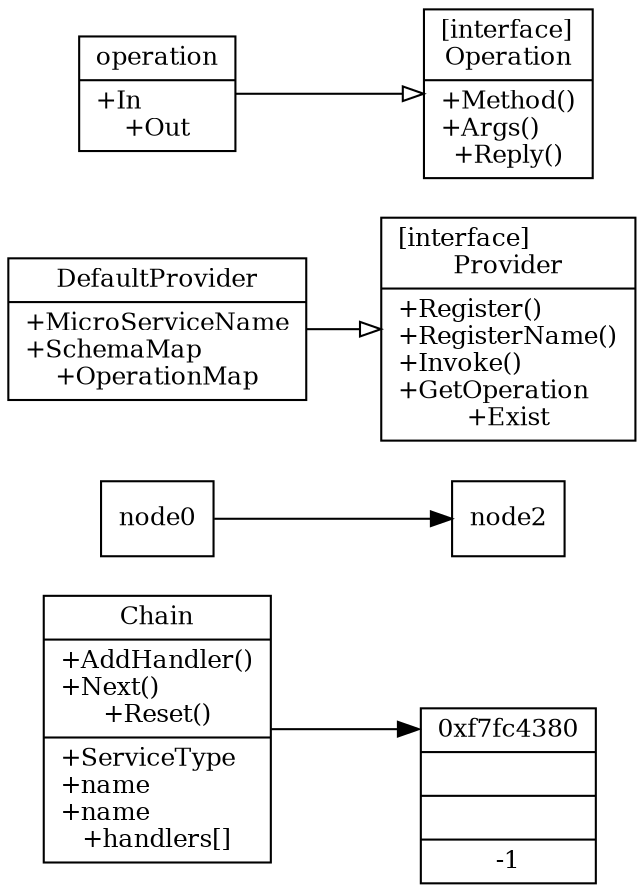

# 演示构建程序调用链

```graphviz
digraph g{

    graph [rankdir = "LR" ];
    node [fontsize = 12, shape = "record" ];
    edge [];

    node1 [label = "<f0> 0xf7fc4380| <f1> | <f2> |-1"];
    chain:f0 -> node1:f0 [id=0];
##    edge [
##            arrowhead = "none"
##            headlabel = "0..*"
##            taillabel = "0..*"
##    ]
    node0:f1 -> node2;

    Provider [
        label = "[interface]\lProvider|+Register()\l+RegisterName()\l+Invoke()\l+GetOperation\l+Exist"
    ];
    Operation [
        label = "[interface]\lOperation|+Method()\l+Args()\l+Reply()"
    ];
    chain [label = "Chain|+AddHandler()\l+Next()\l+Reset()|+ServiceType\l+name\l+name\l+handlers[]" ];
    DefaultProvider [
        label = "DefaultProvider|+MicroServiceName\l+SchemaMap\l+OperationMap"
    ];
    operation [
        label = "operation|+In\l+Out"
    ];    

    DefaultProvider -> Provider [  arrowhead = "empty" ];
    operation -> Operation [  arrowhead = "empty" ];

}
```

